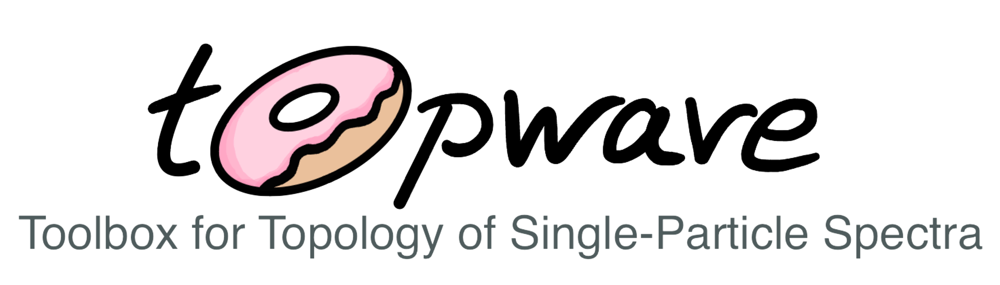
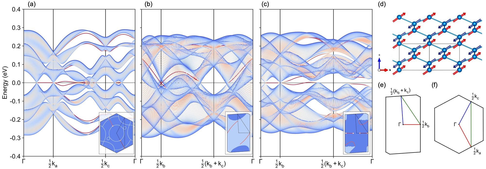

.. topwave documentation master file, created by
   sphinx-quickstart on Wed May  3 15:49:42 2023.
   You can adapt this file completely to your liking, but it should at least
   contain the root `toctree` directive.

The `topwave` library is a python package to quickly set up single-particle models and classify their band topological phases.

The library is designed to be easy to use *and read*. It allows even new-comers to calculate topological properties
of e.g. electron or magnon spectra with only a few lines of code. The package interfaces with the extensive
`Python Materials Genomic library <https://pymatgen.org/>`_  helping the user to quickly set up both easy toy models
and more realistic simulations for materials respecting the symmetries of the crystal structure.

.. admonition:: Disclaimer
   :class: warning

   Topwave is still under development. This is only an alpha version. Please report bugs.

.. admonition:: Do you like topwave?
   :class: seealso

   Give us a star on GitHub! Tell you friends and colleagues!

Features
--------

- Fast-assembly of crystal structures using crystallographic data or pymatgen
- Use of space group symmetries to quickly create models and interactions
- Magnon Dispersion and Neutron Scattering using linear spin wave theory
- Electronic band structures of tight binding models
- Computation of topological invariants using Wilson loops
- Supercell calculations for magnetic relaxation and topological surface states
- Easy construction of twisted structures

Roadmap
-------

- Multi Orbital Tight Binding Models
- Higher Order Topological Invariants
- BdG Hamiltonians
- Self-Consistent Mean Field Calculations
- Wannier90 Interface
- Model Construction based on Irreducible Representations.

Acknowledgements
----------------

This library is being developed within my research as a PhD student of the Max Planck Institute for Solid State
Research in Stuttgart, Germany and the University of British Columbia, Canada within the
`International PhD Program in Quantum Materials <https://www.fkf.mpg.de/7021396/60_Joint_PhD>`_.
I would like to thank Xianxin Wu, Jean-Claude Passy and my supervisor Andreas Schnyder.
Also thanks to Luis Mantilla who helped me setting up the documentation.

I used the `PythTB <https://www.physics.rutgers.edu/pythtb/>`_ and `SpinW <https://spinw.org/>`_ libraries for testing and
to get an idea of what kind of user interface I want.

Topwave interfaces with `Python Materials Genomic library <https://pymatgen.org/>`_ which provides an extensive toolbox
for everything related to crystallography.

Citation
--------

If this library was useful to you in your research, please cite us::

   @software{Heinsdorf_Topwave_2023,
      title = {{topwave: Toolbox for Topology of Single-Particle Spectra}},
      author = {Heinsdorf, Niclas},
      year = {2023},
      url = {https://github.com/nheinsdorf/topwave},
   }

.. admonition:: Used topwave in a paper?
   :class: warning

   Contact me and we can include your work as an example file in the documentation.

Topwave in Research
-------------------

**IrF4: From tetrahedral compass model to topological semimetal**

C Shang, O. Ganter, N. Heinsdorf, SM. Winter - Phys. Rev. B, 2023 - APS

https://doi.org/10.1103/PhysRevB.107.125111

.. toctree::
   :maxdepth: 2
   :caption: Contents:

.. toctree::
   :caption: Tutorials
   :hidden:
   :maxdepth: 2

   tutorials/intro-to-spinwave.rst

   tutorials/intro-to-tightbinding.rst

.. toctree::
   :caption: Examples
   :hidden:
   :maxdepth: 2

   examples/breathing_pyrochlore.rst

.. toctree::
   :caption: API Reference
   :hidden:
   :maxdepth: 2

   api

